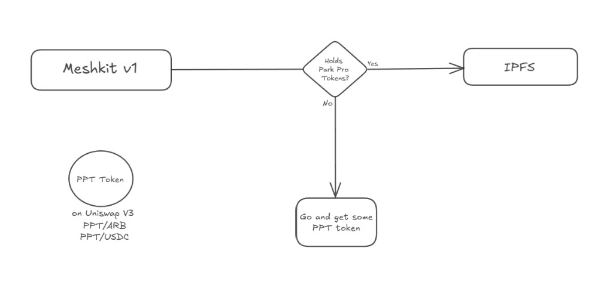
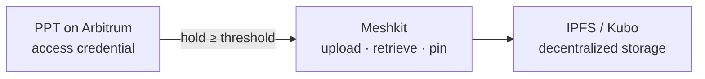
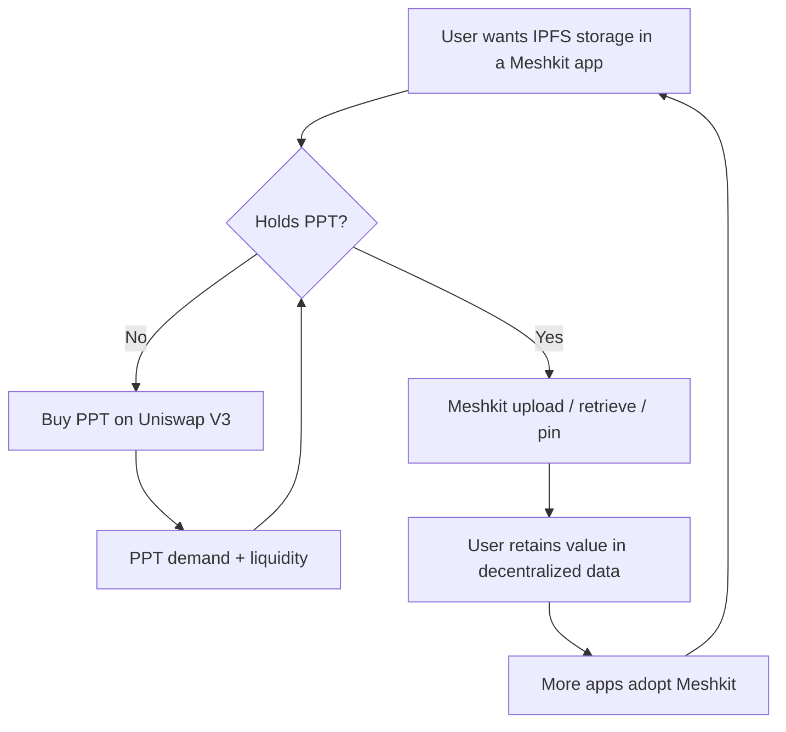
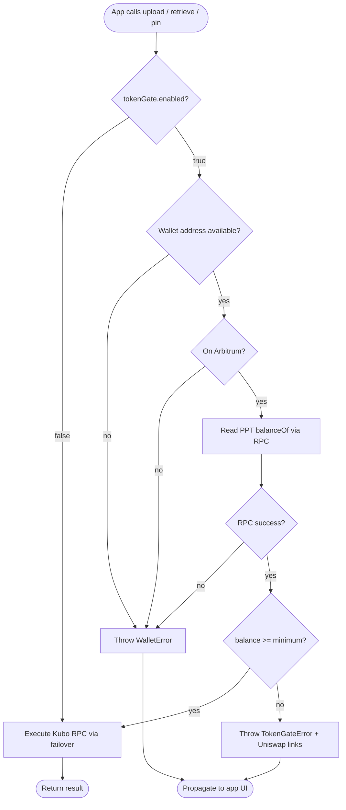
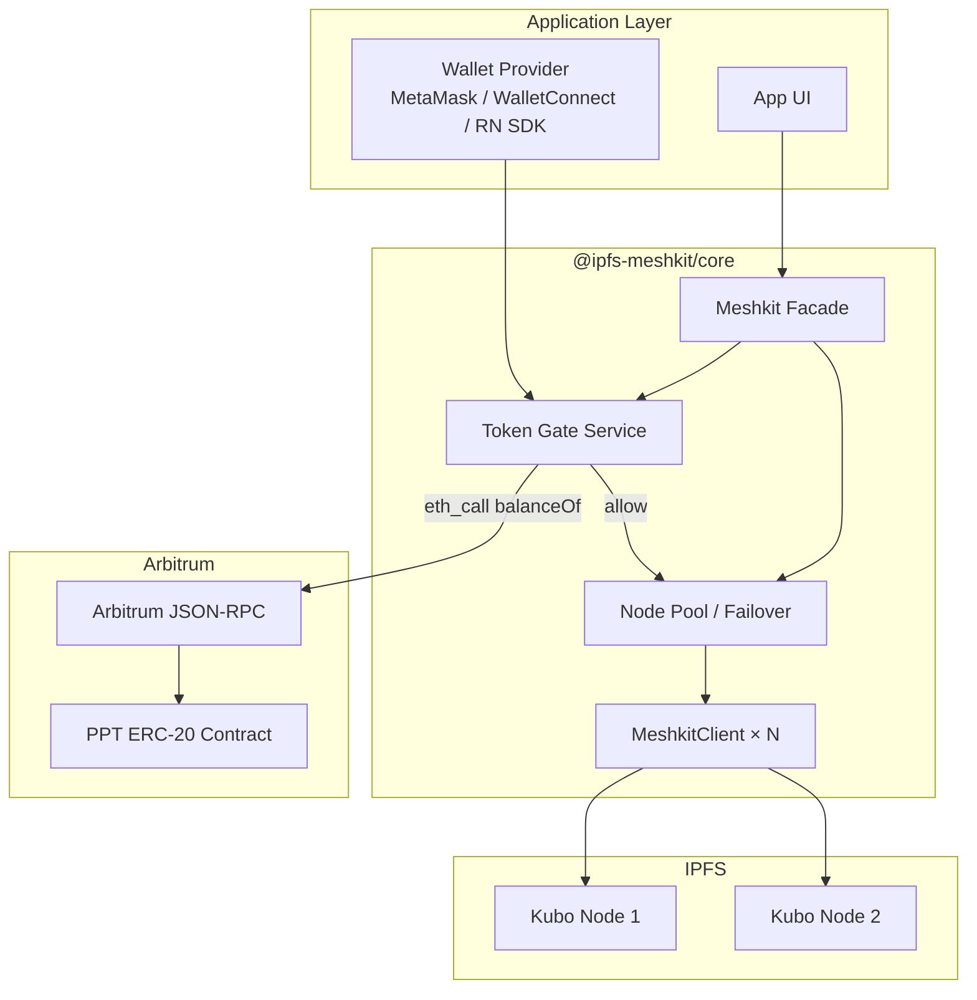

# Meshkit: Project Proposal: IPFS Storage SDK with PPT Token-Gated Access

**Project:** Meshkit  
**Proposal:** A TypeScript SDK for decentralized IPFS storage (`upload`, `retrieve`, `pin`) on mobile and web: with **Park Pro Token (PPT)** hold-to-use gating built into the core product design  
**Document type:** Project proposal, value-proposition design, and technical specification  
**Version:** 1.7 (draft)  
**Status:** Living document: values marked `[TBD]` require confirmation before implementation

---

## Table of Contents

1. [Introduction](#1-introduction)
2. [Meshkit Value Proposition](#2-meshkit-value-proposition)
3. [What Meshkit Is](#3-what-meshkit-is)
4. [Problem Statement](#4-problem-statement)
5. [Goals, Constraints, and Non-Goals](#5-goals-constraints-and-non-goals)
6. [Token-Gated Access Model](#6-token-gated-access-model)
7. [Park Pro Token (PPT) Specification](#7-park-pro-token-ppt-specification)
8. [Tokenomics](#8-tokenomics)
9. [System Architecture](#9-system-architecture)
10. [API Specification](#10-api-specification)
11. [Current Progress](#11-current-progress)
12. [Testing Strategy](#12-testing-strategy)
13. [Documentation Skill Specification](#13-documentation-skill-specification)
14. [Implementation Roadmap](#14-implementation-roadmap)
15. [Open Decisions](#15-open-decisions)
16. [References](#16-references)

---

## 1. Introduction

### 1.1 Purpose of This Document

This document is the **Meshkit project proposal:** the full case for what Meshkit is, why it should exist, and how it is built. Meshkit is not a side feature on top of something else, and PPT is not a standalone proposal. **Meshkit is the product; PPT-gated IPFS access is how that product works.**

The proposal covers:

- **What Meshkit is:** an IPFS storage SDK for React Native, Flutter, Capacitor, and Node.js (§3)
- **Why Meshkit matters:** decentralized `upload`, `retrieve`, and `pin` against Kubo, with multi-node failover and mobile support (§2, §4)
- **How access works:** holders of Park Pro Token (PPT) on Arbitrum use Meshkit APIs; non-holders are routed to supported exchanges (CEX or DEX) (§2, §6-8)
- **How it is implemented:** architecture and API (§9–10)
- **How it ships:** roadmap, open decisions, documentation skill (§13–15)

### 1.2 What This Proposal Delivers

Meshkit is proposed as a **complete SDK product** with three integrated pillars:

| Pillar | What Meshkit delivers |
|--------|----------------------|
| **IPFS storage SDK** | `Meshkit.init`, `upload`, `retrieve`, `pin` against Kubo RPC; multi-node failover |
| **PPT token-gated access** | Hold-to-use gate via ERC-20 `balanceOf` on Arbitrum before every storage operation |
| **Mobile & hybrid support** | `@ipfs-meshkit/react-native`, `@ipfs-meshkit/capacitor`, polyfills for real devices |

PPT is the **access credential**. Meshkit is the **product that consumes and enforces it** while delivering IPFS storage to apps.

### 1.3 Scope

**In scope for Meshkit (this proposal):**

- Core SDK: `Meshkit` facade, Kubo client, health checks, node failover (`@ipfs-meshkit/core`)
- PPT gate: wallet balance check, `TokenGateError`, Uniswap onboarding links (PPT/ARB, PPT/USDC)
- Platform packages: React Native, Flutter, and Capacitor adapters
- Technical documentation and a Documentation skill blueprint

**Out of scope for v1** (unless promoted in §15):

- On-chain micropayments per upload/retrieve
- Kubo-native authorization plugins
- Multi-chain PPT deployment

### 1.4 Reference Diagram

The Meshkit user flow: storage through the SDK, access controlled by PPT:



**Meshkit** is the entry point. Every IPFS action passes through a **PPT balance check**. Sufficient balance → **IPFS** (`upload`, `retrieve`, `pin`). Insufficient balance → **acquire PPT on Uniswap V3**.

---

## 2. Meshkit Value Proposition

This section states **why Meshkit should be built** and how PPT fits into the product, not as an afterthought, but as the designed access model for IPFS storage.

### 2.1 Value Proposition (One Sentence)

**Meshkit is the SDK for PPT-gated IPFS storage: hold PPT, use Meshkit, store and access data on IPFS.**

Meshkit gives developers one integration for decentralized file storage on mobile and web. Park Pro Token (PPT) is the on-chain credential that unlocks it: `upload`, `retrieve`, and `pin` against Kubo nodes for wallets that hold enough PPT.

### 2.2 The Problem Meshkit Solves

Developers building invoice apps, document backup, and field-data products need **decentralized storage on mobile** without running IPFS inside the app. Today there is **no maintained IPFS SDK for React Native, Flutter, or Capacitor**—only low-level Kubo RPC, manual polyfills, and per-app failover glue. Access control and user onboarding are a second layer on top. Full problem breakdown: **§4**.

| Gap | Without Meshkit | With Meshkit |
|-----|-----------------|--------------|
| **Mobile IPFS SDK** | Raw Kubo RPC; RN polyfills by hand; no Flutter/Capacitor package | One API: `upload` / `retrieve` / `pin`; RN/Flutter/Capacitor packages; failover |
| **Access control** | Open Kubo URLs or custom auth per app | PPT hold-to-use gate on every storage call |
| **User onboarding** | No standard path when denied | `TokenGateError` + Uniswap V3 (PPT/ARB, PPT/USDC) |

**Meshkit utility definition:**  
*Meshkit is how apps and users perform IPFS storage operations: upload, retrieve, and pin on Kubo nodes, with PPT on Arbitrum as the required access credential.*

PPT does not replace Meshkit. **Meshkit is the product; PPT is what grants access to it.**

### 2.3 Why PPT Powers Meshkit Access

Meshkit is designed around PPT as the access layer. Park Pro Token is an **ERC-20 on Arbitrum**; Meshkit reads `balanceOf(wallet)` before each storage operation.

| Property | Role in Meshkit |
|----------|-----------------|
| **On-chain verifiability** | Any Meshkit client can check eligibility via Arbitrum RPC |
| **Hold-to-use** | Users keep PPT; no per-upload gas in v1 |
| **DEX liquidity** | Uniswap V3 (PPT/ARB, PPT/USDC) is the onboarding path when gate fails |
| **ERC-20 standard** | Stable `balanceOf` interface across wallets and platforms |

### 2.4 Meshkit Product Architecture (Value View)



| Layer | Role |
|-------|------|
| **PPT** | On-chain access credential; liquid on Uniswap |
| **Meshkit** | The proposed SDK: checks PPT, executes IPFS operations, mobile support |
| **IPFS (Kubo)** | Where data lives: content-addressed, portable, decentralized |

### 2.5 Adoption Flywheel



1. **Demand:** Apps ship with Meshkit for IPFS storage; access requires PPT.
2. **Acquisition:** Users without PPT buy on Uniswap (PPT/ARB or PPT/USDC).
3. **Usage:** Holders use Meshkit storage APIs; data on IPFS reinforces product value.
4. **Adoption:** More apps → more users → stronger Meshkit and PPT ecosystem.

The reference diagram (`docs/assets/token-gate-flow.png`) is the user-facing expression of this loop: **Meshkit** at entry, **PPT check**, then **IPFS** or **get PPT**.

### 2.6 What Meshkit Storage Looks Like in Practice

For end users and developers, "token-gated IPFS storage" is not abstract. It maps directly to Meshkit methods:

| User intent | Meshkit API | What happens on IPFS | PPT required? |
|-------------|-------------|----------------------|---------------|
| Save a file | `mk.upload(bytes)` | Content added to Kubo; CID returned | Yes |
| Open a file by CID | `mk.retrieve(cid)` | Bytes fetched from Kubo | Yes |
| Keep a file pinned | `mk.pin(cid)` | CID pinned on node (not GC'd) | Yes |
| Check node is up | `Meshkit.init({ nodes })` | Health check only | No (diagnostics) |

**Example (invoice app):** A freelancer app uses Meshkit to upload PDF invoices to IPFS. The freelancer connects a wallet. If they hold PPT, `upload` succeeds and returns a CID they can share. If not, the app shows Meshkit's `TokenGateError` and a link to buy PPT, then they retry.

### 2.7 Stakeholder Value

#### End users (PPT holders)

- **Decentralized storage** without running their own Kubo node in the app
- **Portable entitlement:** same wallet works across any Meshkit app on Arbitrum
- **Transparent qualification:** balance and Uniswap links in one error type
- **Retain tokens:** hold-to-use; no per-file gas

#### App developers

- **One integration:** `@ipfs-meshkit/core` + `tokenGate` in `Meshkit.init`
- **Unchanged call sites:** still `upload` / `retrieve` / `pin` after init
- **Aligned with Park Pro:** apps participate in PPT utility without building token logic from scratch
- **Mobile-ready:** React Native, Flutter, and Capacitor packages share the same gate

#### Park Pro / PPT ecosystem

- **Defined utility:** PPT required for a real product action (IPFS storage)
- **DEX-aligned onboarding:** Uniswap V3 pools are the official off-ramp into eligibility
- **Measurable adoption:** Meshkit API usage shows PPT-gated storage in production (see §2.10)
- **Composability:** PPT used for storage today; same token extensible to other gates later

#### Node operators

- **Policy at the edge:** client gate reduces casual abuse of shared Kubo URLs
- **Future path:** server-side attestation can reinforce the same PPT rule (§2.13)

### 2.8 Product Design Principles

These principles define Meshkit as a product. Engineering details are in §6-10.

| Principle | Design choice |
|-----------|---------------|
| **Meshkit is the product** | IPFS SDK + PPT gate + mobile packages ship as one proposal |
| **PPT is the access layer** | Hold-to-use on Arbitrum; gate runs before every storage operation |
| **Fail closed** | No PPT / wrong chain / RPC failure → no IPFS operation |
| **Fail informed** | `TokenGateError` includes balance, minimum, Uniswap links |
| **Developer opt-out** | `tokenGate.enabled: false` for local dev and tests |
| **Ops before entitlement** | `init` stays ungated so connectivity can be debugged without tokens |
| **API stability** | Gate is configured at init; `Meshkit` method signatures unchanged |

### 2.9 Meshkit API Surface

The **Meshkit public API is the product interface:** IPFS storage operations with PPT gating configured at init:

```typescript
// Meshkit: connect to Kubo nodes + PPT access credential
const mk = await Meshkit.init({
  nodes: ['https://ipfs.example.com:5001'],
  tokenGate: {
    enabled: true,
    contractAddress: '0xTBD',      // PPT on Arbitrum
    chainId: 42161,
    walletAddress: userWallet,
    minimumBalance: 10n ** 18n,    // [TBD] e.g. 1 PPT
    rpcUrl: arbitrumRpc,
    uniswap: { pptArb: '…', pptUsdc: '…' },
  },
});

// Meshkit storage: each gated call checks PPT, then IPFS:
const cid = await mk.upload(documentBytes);
const bytes = await mk.retrieve(cid);
await mk.pin(cid);
await mk.unpin(cid);
const links = mk.share(cid);

const batch = await mk.bulkUpload(items, { concurrency: 2, onProgress: ui.update });
```

**Contract between token and SDK:**

| PPT side | Meshkit side |
|----------|--------------|
| User holds ≥ `minimumBalance` on Arbitrum | `assertEligible()` passes |
| User below threshold | `TokenGateError` + Uniswap URLs |
| Token liquid on Uniswap | User can become eligible without off-chain signup |
| ERC-20 `balanceOf` | Single source of truth for v1 gate |

No separate "PPT SDK" is proposed. **Meshkit is the product; PPT is checked inside it.**

### 2.10 Success Metrics

How to measure whether the **Meshkit product** is succeeding:

| Metric | What it indicates |
|--------|-------------------|
| Apps shipping Meshkit | Developer adoption of the SDK |
| `upload` / `retrieve` / `pin` success rate | Users actively storing data via Meshkit |
| `TokenGateError` → retry success rate | PPT onboarding path works inside Meshkit |
| Unique wallets passing gate per week | Active Meshkit users |
| Meshkit app launches ↔ PPT DEX volume | Product driving token demand |

`[TBD]`: instrumentation hooks (analytics events on gate pass/fail) may be added in a later phase.

### 2.11 Positioning and Messaging

**For developers:**  
*"Meshkit is the IPFS storage SDK for mobile and web. Connect Kubo nodes, call upload/retrieve/pin; access is gated by Park Pro Token (PPT) with Uniswap onboarding built in."*

**For end users:**  
*"Use Meshkit-powered apps to store and access files on IPFS. Hold PPT to get started; get it on Uniswap if you need it."*

**For the ecosystem:**  
*"Meshkit is the product. PPT is the key. IPFS is the storage."*

### 2.12 Document Map

| Section | Role in the Meshkit proposal |
|---------|------------------------------|
| §3 | What Meshkit is: SDK architecture and packages |
| §4 | Problems Meshkit is built to solve |
| §6-8 | PPT access model, token specification, and tokenomics |
| §9-10 | Architecture and API (integration surface) |
| §13 | Documentation for shipping Meshkit |

### 2.13 Future Extensions

Hold-to-use is v1. Future Meshkit releases can extend the same product surface:

| Extension | What it adds to Meshkit |
|-----------|-------------------------|
| Tiered thresholds | More PPT → higher pin quota or upload policy |
| Per-operation metering | Optional micropayment or burn for premium pins |
| Server attestation | Kubo proxy verifies PPT before RPC |
| Cross-app pinning marketplace | PPT for prioritized pin on operator nodes |

---

## 3. What Meshkit Is

Meshkit is proposed as a **TypeScript SDK** that connects apps to Kubo IPFS nodes and enforces PPT-gated access before storage operations. This section describes the product architecture.

### 3.1 Overview

**Meshkit** targets mobile and hybrid frameworks (React Native, Flutter, Capacitor/Ionic) and Node.js.

It does **not** embed an IPFS node in the app. It speaks HTTP to a **running Kubo (go-ipfs) daemon** on the developer's PC, LAN, or VPS. Data lives on that node. The SDK is a typed client over Kubo's RPC API (`kubo-rpc-client`). The public facade is the `Meshkit` class in `@ipfs-meshkit/core`.

**Proposed access model:** before `upload`, `retrieve`, or `pin`, Meshkit checks PPT balance on Arbitrum. That gate is part of the product design, not an optional plugin.

### 3.2 Package Structure

| Package | Role |
|---------|------|
| `@ipfs-meshkit/core` | `Meshkit` facade, `createMeshkitClient`, failover, health checks |
| `@ipfs-meshkit/react-native` | Re-exports core + `polyfills` entry for RN runtime gaps |
| `@ipfs-meshkit/flutter` | Dart facade: Kubo HTTP client, PPT gate, same API surface as core |
| `@ipfs-meshkit/capacitor` | Capacitor plugin scaffold + web fallback |

### 3.3 Current Initialization Flow

`Meshkit.init(options)` accepts:

- `nodes: string[]`: Kubo RPC URLs in **priority order** (primary first, others for failover)
- `headers?: Record<string, string>`: optional HTTP headers (e.g. API auth on the node)

On init, the SDK:

1. Creates one `MeshkitClient` per URL via `createMeshkitClient`
2. Runs `healthCheck()` on each (calls `ipfs.id()`)
3. Drops unreachable nodes
4. Throws `MeshkitError` if **zero** nodes are healthy
5. Returns a `Meshkit` instance with `activeNodes` listing survivors

There is **no wallet**, **no blockchain RPC**, and **no identity** beyond whatever the Kubo endpoint enforces (often nothing on local dev).

### 3.4 Current Operation Semantics

Each public method on `Meshkit` uses `withFailover`: try nodes in order until one succeeds.

| Method | Kubo RPC | Behavior |
|--------|----------|----------|
| `upload(data: Uint8Array)` | `ipfs.add(data, { pin: false })` | Returns CID string; does not pin by default |
| `retrieve(cid: string)` | `ipfs.cat(cid)` | Streams chunks into a single `Uint8Array` |
| `pin(cid: string)` | `ipfs.pin.add(cid)` | Pins CID on the node |
| `healthCheck()` (per client) | `ipfs.id()` | Used only at init |

### 3.5 Authorization Model (Proposed)

Meshkit proposes **two layers** of access:

| Layer | Mechanism |
|-------|-----------|
| **Network** | App must reach Kubo RPC URL (optional HTTP headers) |
| **PPT (product gate)** | Wallet must hold ≥ minimum PPT on Arbitrum before storage ops |

Without the PPT layer, any client with the Kubo URL can use storage: which is why PPT gating is core to the Meshkit proposal.

### 3.6 Deployment Patterns

1. **Local development:** `ipfs daemon` on the dev machine; app uses `127.0.0.1:5001` (Node) or LAN IP (physical mobile device)
2. **Single VPS:** one Kubo instance; app points to `https://node.example.com:5001`
3. **Multi-node failover:** primary local + backup VPS; `withFailover` masks transient failures

In all patterns, Meshkit adds **wallet-bound PPT checks** before storage operations. Network reachability alone is not enough.

---

## 4. Problem Statement

### 4.1 The Core Problem: No Mobile-Ready IPFS SDK

Developers building **mobile and hybrid apps** (React Native, Flutter, Capacitor/Ionic) who want IPFS storage today have **no supported, framework-native SDK** that covers the full path from app code to a running **Kubo** node.

IPFS tooling in the ecosystem is aimed mainly at **Node.js, browsers with heavy bundling, or operators running Kubo directly**. A freelancer invoice app, a field-data collector, or an IoT companion app on a phone cannot call `ipfs.add` the way a server script does. The developer is left to:

1. Wire up **low-level Kubo HTTP RPC** (`kubo-rpc-client` or raw REST) by hand.
2. Fix **runtime gaps** on mobile (missing `fetch` streams, `TextEncoder`, URL parsing, crypto randomness).
3. Solve **networking** between the device and the node (`127.0.0.1` does not work on a physical phone; LAN IP, TLS, Android cleartext, iOS local-network permissions).
4. Reimplement **resilience** (health checks, failover across nodes) in every app.
5. Build **access control and user onboarding** separately if the Kubo endpoint must not be open to the world.

Meshkit is proposed because this work is repeated in every project and is **not** what app developers should be rebuilding.

### 4.2 What Developers Face Today (Without Meshkit)

| Today | Pain |
|-------|------|
| Use `kubo-rpc-client` directly in an app | Assumes a Node-like environment; breaks or needs shims on RN |
| Copy-paste HTTP calls to `/api/v0/add`, `/cat`, `/pin` | No typed facade, no shared error model, no failover |
| Run Kubo only on a VPS with a public URL | Single point of failure; no client-side failover pattern |
| Expose Kubo API with a static API key in headers | Key in the app binary; not per-user; not portable across frameworks |
| Skip IPFS on mobile | Ship only centralized storage; lose decentralization goals |

There is **no first-party IPFS package** published for React Native, Flutter, or Capacitor that says: *init nodes, upload, retrieve, pin, handle failures, work on device*.

### 4.3 Framework-Specific Gaps

| Framework | What is missing today | What the developer must do manually |
|-----------|----------------------|-------------------------------------|
| **React Native** | No maintained `@ipfs/*` RN package | Install polyfills (`fetch`, streams, `TextEncoder`, `getRandomValues`, URL); use LAN/VPS URL instead of localhost; configure Android cleartext / iOS local network |
| **Flutter** | No standard Dart IPFS/Kubo SDK | Write Dart `http` client against Kubo RPC; parse multipart responses; handle failover and errors in app code |
| **Capacitor / Ionic** | No Capacitor plugin for Kubo storage | Use core JS from WebView or bridge; wallet and RPC quirks across native vs web |
| **Node.js / desktop** | `kubo-rpc-client` works but is low-level | Still no multi-node failover, health gating at init, or token gate in one facade |

Meshkit targets **one API surface** (`Meshkit.init`, `upload`, `retrieve`, `pin`, …) across these frameworks, with platform packages handling RN polyfills and (proposed) Flutter/Capacitor adapters.

### 4.4 Operational Gaps on Mobile

Even after HTTP calls work, production mobile apps hit problems the raw RPC client does not solve:

- **Node reachability:** Kubo runs on the developer PC, office LAN, or VPS—not inside the app. The SDK must support **ordered node lists** and **failover** when the primary node is down.
- **Health at startup:** Failing fast when *no* node is reachable avoids obscure errors on first `upload`.
- **Binary data:** Mobile apps work with photos, PDFs, and sensor blobs as `Uint8Array` / bytes; the SDK should accept bytes and return a **CID**, not require the app to speak IPFS wire formats.
- **Batch workloads:** Gallery backup or document sets need **queued bulk upload**, not one-off copy-paste loops.

### 4.5 Access Control and Onboarding (Second Problem)

Once IPFS calls work, **who may store data** remains unsolved if the Kubo URL is shared:

- A public or leaked RPC URL lets **anyone** with the endpoint upload or pull data; header secrets in the app are extractable.
- There is **no per-user entitlement** tied to a wallet or account without custom backend middleware.
- When a user is blocked, apps lack a **standard path** to qualify (hold PPT, acquire on Uniswap V3).

Meshkit adds a **PPT hold-to-use gate** on Arbitrum and **`TokenGateError`** with exchange links so access policy and onboarding are part of the same SDK—not a separate project.

### 4.6 Why PPT Is Part of This Proposal

PPT is the chosen credential because ERC-20 `balanceOf` on Arbitrum is verifiable from the client, portable across RN/Flutter/Capacitor, and liquid on Uniswap V3—without per-upload gas in v1.

### 4.7 Stakeholders

| Stakeholder | Problem Meshkit solves |
|-------------|------------------------|
| **Mobile app developer** | One SDK for Kubo + mobile runtimes + optional PPT gate |
| **End user** | Store and retrieve files in apps; clear path to get PPT when denied |
| **Park Pro ecosystem** | PPT utility tied to real storage actions |
| **Node operator** | Fewer anonymous open-RPC abuses when apps use the gate |

### 4.8 Formal Problem Statement

> **Meshkit shall provide an SDK for IPFS storage (`upload`, `retrieve`, `pin`, `unpin`, `share`, bulk upload) against Kubo nodes with multi-node failover and first-class support for React Native, Flutter, and Capacitor, requiring wallets to hold a minimum PPT balance on Arbitrum before gated storage operations, and directing ineligible users to acquire PPT on Uniswap V3.**

### 4.9 Meshkit Product Definition (v1)

| Capability | Meshkit v1 |
|------------|------------|
| IPFS operations | `upload`, `retrieve`, `pin` (+ proposed `unpin`, `share`, `bulkUpload`) |
| Resilience | Multi-node failover, health checks at init |
| Mobile | RN polyfills package; Flutter and Capacitor adapters (proposed) |
| Access | PPT `balanceOf` gate on Arbitrum |
| Denial UX | `TokenGateError` + Uniswap V3 links |
| Dev mode | `tokenGate.enabled: false` for local Kubo testing |

---

## 5. Goals, Constraints, and Non-Goals

### 5.1 Goals

**G1: Entitlement before IO**  
Every gated operation (`upload`, `retrieve`, `pin`) must await a successful token gate evaluation before any Kubo RPC is invoked.

**G2: Fail closed on ambiguity**  
If the gate cannot determine eligibility (RPC down, wrong chain, no wallet address), the operation must **not** proceed to IPFS. The error must state what the user or developer should fix.

**G3: Developer ergonomics**  
Existing `Meshkit.init({ nodes })` call sites add a `tokenGate` block; method signatures on `Meshkit` stay unchanged.

**G4: Actionable end-user denial**  
`TokenGateError` includes: current balance, required minimum, formatted human amounts, and links to PPT/ARB and PPT/USDC on Uniswap V3.

**G5: Documented thoroughly**  
This proposal plus the Documentation skill (§13) enable accurate public docs without re-deriving design decisions.

### 5.2 Constraints

**C1: Client-side enforcement in v1**  
The gate runs in the app process. Kubo remains unaware of PPT unless the operator adds separate middleware (out of v1 scope).

**C2: Arbitrum only**  
PPT contract and `balanceOf` reads target Arbitrum One (`chainId` 42161) unless §15 changes this.

**C3: Read-only chain interaction**  
v1 only **reads** `balanceOf`. No `transfer`, `approve`, or meta-transactions.

**C4: Backward compatibility**  
`tokenGate` is optional. Omitting it or setting `enabled: false` preserves today's behavior.

### 5.3 Non-Goals (v1)

- Burning or transferring PPT per operation
- NFT-based gating (ERC-721/1155)
- Staking or time-locked balances
- Replacing Kubo or embedding IPFS in-process
- Guaranteed server-side enforcement without operator action
- Wallet private key management inside Meshkit

---

## 6. Token-Gated Access Model

### 6.1 Gate Type: Threshold Balance (Hold-to-Use)

Meshkit implements a **static threshold gate** as part of the product:

```
eligible(wallet) := balanceOf(PPT, wallet) >= minimumBalance
```

- `minimumBalance` is in **token base units** (wei-style: `10n ** 18n` for 1 PPT if decimals = 18)
- No expiry: balance checked at operation time (with optional short TTL cache per §9.4)
- Spending PPT on Uniswap reduces balance; user may become ineligible until they hold enough again

### 6.2 Gating Granularity

| Operation | Gated? | Rationale |
|-----------|--------|-----------|
| `upload` | **Yes** | Primary cost: ingesting data onto IPFS |
| `retrieve` | **Yes** | Prevents free egress via shared Kubo URL |
| `pin` / `unpin` | **Yes** | Pinning consumes node storage |
| `bulkUpload` | **Yes** | Each queued item runs the gate before `ipfs.add` |
| `share` | **No** | Link formatting only; no Kubo RPC |
| `Meshkit.init` | **No** | Allow node health diagnosis without tokens |

### 6.3 Decision Flow



### 6.4 Relationship to the Reference Diagram

The diagram encodes the same logic from the **user journey** perspective:

1. User opens an app using **Meshkit**
2. User attempts an IPFS action
3. System asks: **"Holds Park Pro Tokens?"**
   - **Yes** → action proceeds against **IPFS**
   - **No** → user is instructed to **get PPT on Uniswap V3** (PPT/ARB or PPT/USDC), then retry

The SDK automates step 3; the app's job is to surface errors and deep-link to Uniswap when needed.

### 6.5 What "Perform Any Action" Means

For v1, gated operations are **all methods that call Kubo**:

- `upload`, `retrieve`, `pin`, `unpin`, `bulkUpload` (each queue item)

`share` is not gated. Future methods (e.g. `ls`, `stat`) should **inherit the same gate** via a single internal `assertTokenGate()` hook.

---

## 7. Park Pro Token (PPT) Specification

### 7.1 Token Identity

| Field | Value |
|-------|-------|
| Name | Park Pro Token |
| Symbol | PPT |
| Standard | ERC-20 (OpenZeppelin) |
| Network | Arbitrum One |
| Chain ID | `42161` |
| Contract | `PPTToken` — `[TBD: testnet/mainnet address]` |
| Decimals | `18` (`1 PPT = 10^18` base units) |
| Max supply | `1,000,000,000` PPT (`MAX_SUPPLY = 1e9 × 10^18`) |
| Minting | `mint(to, amount)` — **onlyOwner**; whole-token amounts |
| Access control | `Ownable`; production owner should be a **multisig** |

### 7.2 On-Chain Contract (`PPTToken`)

PPT is deployed as **`PPTToken`**: OpenZeppelin `ERC20` + `Ownable`. Supply is **capped**, not unlimited. The owner may mint additional whole tokens until `MAX_SUPPLY` is reached.

| Mechanism | Behavior |
|-----------|----------|
| **Constructor** | Mints `initialSupply` (whole tokens) to deployer |
| **`mint(to, amount)`** | Owner mints `amount` whole tokens to `to`; reverts with `MaxSupplyExceeded` if cap would be exceeded |
| **`MAX_SUPPLY`** | 1 billion PPT (1e9 × 10^18 base units) |
| **Meshkit** | Calls `balanceOf` only; does **not** call `mint` |

```solidity
uint256 public constant MAX_SUPPLY = 1e9 * 1e18;

function mint(address to, uint256 amount) external onlyOwner {
    uint256 mintAmount = amount * 1e18;
    if (totalSupply() + mintAmount > MAX_SUPPLY) revert MaxSupplyExceeded();
    _mint(to, mintAmount);
}
```

Initial deploy supply and future mint allocations (liquidity, ecosystem, treasury) are operational decisions under the owner/multisig — not controlled by Meshkit.

### 7.3 Meshkit Contract Calls (v1)

Only **view** functions are required for v1:

```solidity
function balanceOf(address account) external view returns (uint256);
function decimals() external view returns (uint8);
function symbol() external view returns (string);
```

Meshkit may call `decimals()` once at init to format errors, or rely on configured decimals to avoid an extra RPC round-trip.

### 7.4 Minimum Balance

| Parameter | Description |
|-----------|-------------|
| `minimumBalance` | Smallest `uint256` balance in base units required for access |
| Default | `[TBD: e.g. 1 PPT = 10^18 base units]` |
| Override | App may set higher threshold; may not set lower than issuer policy if a canonical default is published |

**Policy note:** Too low → spam; too high → onboarding friction. This is a product decision recorded in §15.

### 7.5 Tokenomics

PPT uses a **capped supply** model: up to **1 billion PPT** on-chain. Circulating supply starts at `initialSupply` in the constructor and can **increase** when the **owner** calls `mint`, until `MAX_SUPPLY`. Meshkit does not mint, burn, or set monetary policy; it only reads `balanceOf` for the hold-to-use gate.

| Lever | Owner | Role |
|-------|-------|------|
| `MAX_SUPPLY` | On-chain constant | Hard cap (1e9 PPT) |
| `mint()` | Contract owner (multisig in production) | Release new tokens within cap |
| `initialSupply` | Deploy-time parameter | Genesis circulation |
| `minimumBalance` | Meshkit config / issuer policy | PPT each user must hold |
| Uniswap V3 liquidity | Issuer / LPs | Secondary market for users |
| Meshkit adoption | Product | Hold demand from gated storage |

**Hold demand:** each wallet using `upload`, `retrieve`, `pin`, `unpin`, or `bulkUpload` must hold `>= minimumBalance`. Owner minting does not waive that rule; it is per-wallet.

**Supply growth vs cap:** minting can increase circulation for liquidity and onboarding, but never above 1 billion PPT. Meshkit utility creates ongoing demand for tokens already in circulation or newly minted to market.

### 7.6 Uniswap V3 Pools (v1)

Primary acquisition when balance is insufficient: **Uniswap V3 on Arbitrum**. Meshkit surfaces deep links in `TokenGateError`; swaps run in the user's wallet.

| Pool | Pair | Use case | Deep link |
|------|------|----------|-----------|
| A | PPT / ARB | ARB ecosystem users | `uniswap.pptArb` `[TBD]` |
| B | PPT / USDC | Stablecoin entry, USD quoting | `uniswap.pptUsdc` `[TBD]` |

| Field | PPT/ARB | PPT/USDC |
|-------|---------|----------|
| Pool address | `[TBD]` | `[TBD]` |
| Fee tier | `[TBD]` | `[TBD]` |

**PPT/ARB:** native Arbitrum onboarding; ETH may route via WETH/ARB. **PPT/USDC:** stable reference leg for fiat-style “cost to qualify” copy. Meshkit checks PPT balance after the user returns; it does not call Uniswap contracts.

### 7.7 Denied-User Flow

`balanceOf(wallet) < minimumBalance` → `TokenGateError` with balances and Uniswap links → user swaps → `invalidateCache()` → retry gated operation.

| Event | Gate effect |
|-------|-------------|
| Buy PPT on Uniswap | Eligible after cache refresh |
| Sell below threshold | Access lost until balance restored |

### 7.8 Exchange Config

| Key | Purpose |
|-----|---------|
| `tokenGate.exchange.primary` | Default Uniswap link (e.g. PPT/USDC) |
| `tokenGate.exchange.secondary` | Alternate link (e.g. PPT/ARB) |

---

## 8. Tokenomics

On-chain policy is defined by **`PPTToken`**: capped at 1 billion PPT, with **owner-controlled `mint`** up to that cap (see §7.2). Meshkit creates **hold demand** via the PPT gate; **Uniswap V3** is the v1 path for users who need to acquire PPT. Meshkit does not mint tokens or set supply policy.

---

## 9. System Architecture

### 7.1 Logical Architecture



### 7.2 Layer Responsibilities

| Layer | Responsibility |
|-------|----------------|
| **Application** | Wallet connection, chain switch UI, display `TokenGateError`, open Uniswap |
| **Meshkit facade** | Public API; orchestrates gate then failover |
| **Token gate service** | Wallet address resolution, chain validation, balance read, cache, errors |
| **Node pool** | Unchanged failover semantics after gate passes |
| **MeshkitClient** | Kubo RPC via `kubo-rpc-client` |
| **Arbitrum RPC** | `eth_call` to PPT contract |
| **Kubo** | Content addressing, pin store |

### 7.3 Call Order Invariant

For every gated operation, the SDK must guarantee:

```
1. assertTokenGate()   // may throw TokenGateError | WalletError
2. withFailover(...)   // may throw MeshkitError
```

Never reverse this order. Hitting Kubo before the gate would violate G1.

### 7.4 Module Layout (Proposed)

```
packages/core/src/
├── meshkit.ts              # add gate calls before upload/retrieve/pin
├── create-client.ts        # unchanged Kubo client
├── node-pool.ts            # unchanged
├── health.ts               # unchanged
├── types.ts                # extend MeshkitInitOptions, errors
└── token-gate/
    ├── index.ts            # createTokenGate, assertTokenGate
    ├── balance.ts          # balanceOf via viem/ethers
    ├── errors.ts           # TokenGateError, WalletError
    ├── format.ts           # base units → human string
    └── types.ts            # TokenGateConfig
```

---

## 10. API Specification

This section defines the public API and how **end users** experience storage through a Meshkit-powered app. The developer calls Meshkit; the user sees screens, buttons, and share sheets.

### 10.1 Initialization

```typescript
interface MeshkitInitOptions {
  nodes: string[];
  headers?: Record<string, string>;
  tokenGate?: TokenGateConfig;
  share?: { defaultGateway?: string };
}
```

`Meshkit.init` connects to Kubo and optionally configures the PPT gate. **No wallet at init.** The user connects a wallet in the app before the first gated operation.

### 10.2 End-User Operations

| API | What the user does | What happens |
|-----|-------------------|--------------|
| `upload` | Picks a file; taps "Save to IPFS" | Bytes stored on Kubo; app gets a CID |
| `retrieve` | Opens a CID or saved item | File loads and displays |
| `pin` | Taps "Keep on node" | Kubo retains the CID |
| `unpin` | Taps "Remove from node" | CID unpinned on that Kubo instance |
| `share` | Taps "Share" | OS share sheet with `ipfs://` and gateway HTTPS link |
| `bulkUpload` | Selects many files; watches progress | Queue uploads with per-file status and CIDs |

Gated: `upload`, `retrieve`, `pin`, `unpin`, `bulkUpload`. **Not gated:** `share` (link formatting only), `init`.

### 10.3 `upload`

```typescript
upload(data: Uint8Array, options?: { pin?: boolean }): Promise<string>
```

**User flow:** select file → confirm → loading → success (CID or "Saved"). Optional `pin: true` pins immediately after upload.

### 10.4 `retrieve`

```typescript
retrieve(cid: string): Promise<Uint8Array>
```

**User flow:** open document, image, or invoice by CID → app renders content.

### 10.5 `pin` and `unpin`

```typescript
pin(cid: string): Promise<void>
unpin(cid: string): Promise<void>
```

**User flow:** pin keeps content on the node; unpin removes it from the node's pin set (CID may still exist elsewhere on IPFS).

### 10.6 `share`

```typescript
interface ShareResult {
  cid: string;
  ipfsUri: string;       // ipfs://<cid>
  gatewayUrl?: string;   // https://<gateway>/ipfs/<cid>
}

share(cid: string, options?: { gateway?: string }): ShareResult
```

**User flow:** tap Share → native share sheet (Messages, email, copy link). No Kubo call; not gated.

### 10.7 `bulkUpload` and Upload Queue

For batch scenarios (photo backup, document sets, IoT batches).

**One-shot API:**

```typescript
interface BulkUploadItem {
  id: string;
  data: Uint8Array;
  filename?: string;
}

interface BulkUploadResult {
  id: string;
  status: 'done' | 'failed';
  cid?: string;
  error?: Error;
}

bulkUpload(items: BulkUploadItem[], options?: BulkUploadOptions): Promise<BulkUploadResult[]>
```

**Queue API (pause / resume):**

```typescript
interface BulkUploadOptions {
  concurrency?: number;      // default 2
  pinAfterUpload?: boolean;  // default false
  onProgress?: (item: BulkUploadProgress) => void;
}

interface BulkUploadProgress {
  id: string;
  status: 'pending' | 'uploading' | 'done' | 'failed';
  cid?: string;
  error?: Error;
}

createUploadQueue(options?: BulkUploadOptions): UploadQueue

interface UploadQueue {
  enqueue(...items: BulkUploadItem[]): void;
  start(): Promise<void>;
  pause(): void;
  resume(): Promise<void>;
  readonly results: ReadonlyArray<BulkUploadResult>;
}
```

**User flow:** select N photos → progress list per row → optional Pause/Resume. `onProgress` drives list UI. Gate runs before each item; mid-queue PPT loss fails remaining items with `TokenGateError` until user acquires PPT and calls `invalidateCache()`.

**Queue rules:** FIFO; `concurrency` limits parallel uploads; one failed item does not stop the queue unless the app pauses.

### 10.8 Full Example

```typescript
const mk = await Meshkit.init({
  nodes: ['https://ipfs.example.com:5001'],
  share: { defaultGateway: 'https://ipfs.io' },
  tokenGate: { enabled: true, /* ... */ },
});

const cid = await mk.upload(fileBytes, { pin: true });
const links = mk.share(cid);
await navigator.share({ url: links.gatewayUrl });

const results = await mk.bulkUpload(
  photos.map((p, i) => ({ id: String(i), data: p.bytes, filename: p.name })),
  {
    concurrency: 2,
    pinAfterUpload: true,
    onProgress: (ev) => ui.updateRow(ev.id, ev.status, ev.cid),
  },
);
```

### 10.9 Development Bypass

```typescript
await Meshkit.init({
  nodes: ['http://127.0.0.1:5001'],
  tokenGate: { enabled: false },
});
```

Or omit `tokenGate` entirely for local Kubo testing.

---

## 11. Current Progress

Work completed or underway at the time of this proposal. Addresses, pool IDs, and audit artifacts marked `[TBD]` will be filled in as finalized.

### 11.1 On-Chain (PPT)

| Item | Status | Detail |
|------|--------|--------|
| PPT ERC-20 contract | **Deployed** | Arbitrum **testnet** `[TBD: contract address]` |
| Uniswap V3 pools | **In progress** | PPT/ARB and PPT/USDC pool creation on testnet `[TBD]` |
| Static analysis | **In progress** | ERC-20 review with **Aderyn** `[TBD: report link]` |
| Mainnet launch | Planned | After testnet validation, audit remediation, and pool liquidity |

### 11.2 Application (Meshkit SDK)

| Item | Status | Detail |
|------|--------|--------|
| `@ipfs-meshkit/core` | In progress | `init`, `upload`, `retrieve`, `pin`, node failover |
| Token gate module | Planned | `balanceOf` check, `TokenGateError`, Uniswap links |
| Extended API | Planned | `unpin`, `share`, `bulkUpload` queue |
| Platform packages | Planned | React Native, Flutter, Capacitor |
| Example app | Planned | Invoice upload demo with PPT gate |

### 11.3 Next Milestones

1. Publish Aderyn audit summary and remediate ERC-20 findings.
2. Confirm Uniswap V3 testnet pools and deep-link URLs for `TokenGateError`.
3. Ship token gate in core SDK; run testnet E2E (0 PPT → swap → upload).
4. Promote PPT and pools to Arbitrum mainnet when audit and liquidity criteria are met.

---

## 12. Testing Strategy

Testing covers **PPT (token)** and **Meshkit (application)**. Goal: verify hold-to-use gating and IPFS operations on testnet before mainnet.

### 12.1 Token (PPT)

| Layer | Scope |
|-------|--------|
| Static analysis | Aderyn scan on ERC-20; resolve high/medium findings before mainnet |
| Contract tests | `MAX_SUPPLY`, constructor `initialSupply`, `mint` onlyOwner, `MaxSupplyExceeded`, `balanceOf` / `decimals` |
| Testnet deployment | Contract live on Arbitrum testnet; address pinned in SDK config |
| Uniswap V3 | Pools exist; swap ARB/USDC → PPT; liquidity and slippage smoke test |
| Economic smoke | Below `minimumBalance` fails gate; post-swap `balanceOf` allows access |

### 12.2 Application (Meshkit)

| Layer | Scope |
|-------|--------|
| Unit | Gate thresholds, cache TTL, `enabled: false`, gate-before-Kubo on denial |
| Unit | `bulkUpload`: queue order, concurrency, per-item gate, pause/resume |
| Unit | `share`: `ipfs://` and gateway URLs; no RPC side effects |
| Integration | Mock Arbitrum RPC + mock Kubo; failover; `TokenGateError` payload |
| Integration | Bulk queue with mixed success/failure |
| Platform smoke | RN / Flutter / Capacitor: init, upload, error UI on one device each |

### 12.3 End-to-End (Manual)

1. 0 PPT on testnet → `TokenGateError` with Uniswap links.
2. Testnet swap → `invalidateCache()` → `upload` succeeds.
3. `retrieve`, `pin`, and `share` on same CID.
4. `bulkUpload` with pause/resume; single failure does not block queue.
5. Wrong chain → `WalletError`; all Kubo nodes down → `MeshkitError` after gate passes.

### 12.4 CI and Environments

- **CI:** Kubo tests with `tokenGate.enabled: false`; gate tests use mocked RPC.
- **Testnet:** PPT contract, Uniswap pools, test ARB/USDC for wallet E2E.
- **Mainnet:** repeat E2E checklist after promotion; no production wallet secrets in CI.

---

## 13. Documentation Skill Specification

This section defines the **Cursor Documentation skill** that authors public docs from this specification. It is part of the deliverable, not an afterthought.

### 13.1 Skill Purpose

Enable agents and contributors to write **accurate, consistent** documentation for **Meshkit:** the full SDK product, not PPT in isolation. **§2 is the value-proposition source of truth.**

### 13.2 Skill Metadata

```yaml
---
name: meshkit-token-gate-docs
description: >-
  Authors documentation for the Meshkit project: IPFS storage SDK with PPT
  token-gated access. Use when writing README, integration guides, API reference,
  value proposition copy, TokenGateError handling, Uniswap onboarding, or
  platform guides for React Native, Flutter, and Capacitor.
---
```

**Location:** `.cursor/skills/meshkit-token-gate-docs/SKILL.md`

### 13.3 Skill File Tree

```
.cursor/skills/meshkit-token-gate-docs/
├── SKILL.md
├── reference/
│   ├── token-contract.md      # Canonical PPT address, chainId, decimals
│   ├── api-token-gate.md      # TokenGateConfig, methods, errors
│   ├── architecture.md        # Diagrams distilled from Proposal.md §9-10
│   ├── uniswap-onboarding.md  # Step-by-step acquire PPT
│   └── platform-guides.md     # RN, Flutter, Capacitor, Node
├── examples/
│   ├── quickstart-gated.md
│   ├── handle-token-gate-error.md
│   └── dev-bypass.md
└── templates/
    ├── readme-section.md
    └── troubleshooting-entry.md
```

### 13.4 SKILL.md Required Sections

When implementing the skill file, include:

1. **Canonical source:** `Proposal.md` at repo root; **§2 defines the Meshkit product**
2. **Terminology:** Park Pro Token (PPT), token-gated access, Arbitrum, Kubo, hold-to-use
3. **Mandatory narrative:** Every user-facing doc explains: Meshkit → PPT check → IPFS or Uniswap
4. **Diagram:** Embed `docs/assets/token-gate-flow.png` or §6.3 mermaid in overview docs
5. **Code rules:** `minimumBalance` as `bigint`; never float literals for token amounts
6. **Validation checklist:** From §13.5 before publishing

### 13.5 Documentation Validation Checklist

- [ ] PPT contract matches `reference/token-contract.md`
- [ ] `chainId` is 42161 (or documented exception)
- [ ] Gated ops: `upload`, `retrieve`, `pin` only
- [ ] Init is **not** gated
- [ ] Uniswap links match PPT/ARB and PPT/USDC pools
- [ ] Mobile LAN/cleartext caveats preserved
- [ ] No private keys in examples

### 13.6 Audience → Document Mapping

| Audience | Document | Key content |
|----------|----------|-------------|
| App developer | README + `quickstart-gated.md` | `Meshkit.init`, try/catch, dev bypass |
| End user | `uniswap-onboarding.md` | How to buy PPT, retry |
| Mobile developer | `platform-guides.md` | Polyfills + wallet + Arbitrum RPC |
| Contributor | Proposal.md | Full specification |

### 13.7 Agent Workflow

```
1. Read Proposal.md § relevant to the task
2. Confirm [TBD] fields: do not invent contract addresses
3. Pick template from templates/
4. Write draft using reference/ facts
5. Run §13.5 checklist
6. Cross-link README ↔ docs/token-gate/*
```

---

## 14. Implementation Roadmap

| Phase | Meshkit deliverable | Depends on |
|-------|---------------------|------------|
| **0** | This project proposal + diagram |: |
| **1** | Core SDK: Kubo client, failover, health (`@ipfs-meshkit/core`) |: |
| **2** | PPT token gate: `token-gate/` module, errors, unit tests | PPT address `[TBD]` |
| **3** | Integrated `Meshkit` facade with `tokenGate` in `Meshkit.init` | Phase 2 |
| **4** | Platform packages: React Native, Flutter, Capacitor | Phase 3 |
| **5** | README, docs, example app (invoice upload) | Phase 4 |
| **6** | Documentation skill files | Phase 5 |

---

## 15. Open Decisions

| ID | Question | Options | Decision |
|----|----------|---------|----------|
| OD-1 | PPT mainnet contract address |: | `[TBD]` |
| OD-2 | Default `minimumBalance` | 1 PPT, 10 PPT, custom | `[TBD]` |
| OD-3 | Wallet library in core | viem / ethers / interface only | `[TBD]` |
| OD-4 | Hardcode mainnet PPT in SDK | yes for `enabled: true` default / no | `[TBD]` |
| OD-5 | Runtime `setTokenGate()` API | yes / no | `[TBD]` |
| OD-6 | Balance cache TTL default | 0 / 30s / 60s | `[TBD]` |
| OD-7 | Exchange deep link URLs | CEX / DEX format | `[TBD]` |
| OD-8 | Server-side proxy in v1.1 | JWT after balance check | `[TBD]` |
| OD-9 | `initialSupply` at deploy | whole tokens minted in constructor | `[TBD]` |
| OD-10 | Owner / multisig | transfer `Ownable` to multisig before mainnet | `[TBD]` |
| OD-11 | Mint allocation policy | treasury, LP, ecosystem splits within `MAX_SUPPLY` | `[TBD]` |

---

## 16. References

| Resource | Path / URL |
|----------|------------|
| Meshkit README | [README.md](./README.md) |
| Core types | [packages/core/src/types.ts](./packages/core/src/types.ts) |
| Meshkit facade | [packages/core/src/meshkit.ts](./packages/core/src/meshkit.ts) |
| Kubo client | [packages/core/src/create-client.ts](./packages/core/src/create-client.ts) |
| Token gate flow diagram | [docs/assets/token-gate-flow.png](./docs/assets/token-gate-flow.png) |
| ERC-20 standard | [EIP-20](https://eips.ethereum.org/EIPS/eip-20) |
| Aderyn (Solidity static analysis) | [github.com/Cyfrin/aderyn](https://github.com/Cyfrin/aderyn) |
| Arbitrum One | Chain ID `42161` |
| Repository | [github.com/seetadev/IPFS-meshkit](https://github.com/seetadev/IPFS-meshkit) |

---

## Document History

| Version | Date | Summary |
|---------|------|---------|
| 0.1 | 2026-06-16 | Initial outline |
| 0.2 | 2026-06-16 | In-depth technical specification: problem statement, architecture, lifecycles, API, security, documentation skill |
| 0.3 | 2026-06-16 | Added §2 value proposition design: PPT utility via Meshkit APIs for token-gated IPFS storage |
| 0.5 | 2026-06-16 | Unified naming to Meshkit throughout |
| 0.6 | 2026-06-16 | Reframed entire doc as Meshkit project proposal; PPT as access layer, not separate proposal |
| 0.7 | 2026-06-16 | Added §8 Tokenomics: expanding PPT supply, utility demand, and policy levers |
| 0.8 | 2026-06-16 | Expanded §7 with tokenomics and Uniswap V3 pool analysis (PPT/ARB, PPT/USDC) |
| 0.9 | 2026-06-16 | Trimmed tokenomics repetition; added Flutter platform integration |
| 1.0 | 2026-06-16 | API spec: end-user flows, share, unpin, bulkUpload queue |
| 1.1 | 2026-06-16 | Current progress (testnet, Uniswap, Aderyn); broader testing strategy |
| 1.2 | 2026-06-16 | Problem statement: mobile IPFS SDK gap (RN, Flutter, Capacitor) in detail |
| 1.3 | 2026-06-16 | Removed component design and platform integration; API is integration surface |
| 1.4 | 2026-06-16 | Removed Operation Lifecycles chapter (covered by API and gate chapters) |
| 1.5 | 2026-06-16 | Tokenomics aligned to PPTToken: capped supply (1e9), onlyOwner mint |
| 1.6 | 2026-06-16 | Removed Error Handling chapter (package scope; errors covered in API and gate model) |
| 1.7 | 2026-06-16 | Removed Security Model chapter (out of scope for SDK package proposal) |
